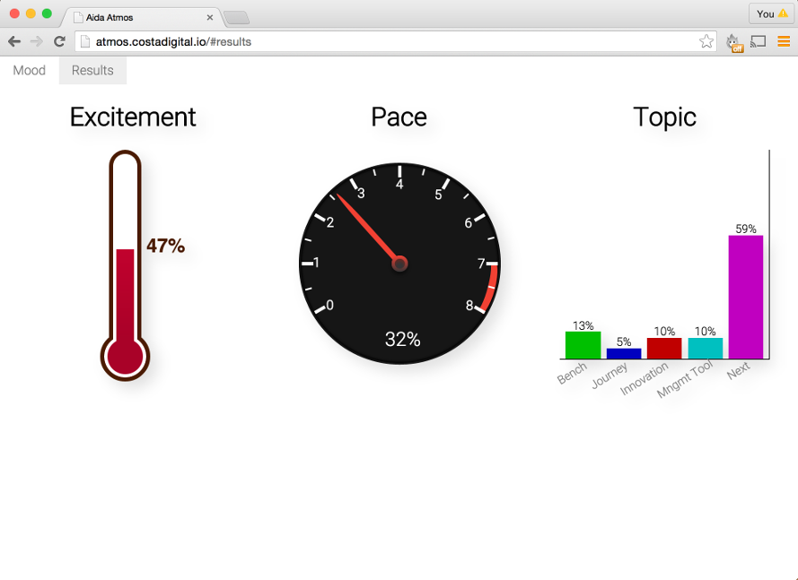

# Travelling Light
## Combining RiotJS, Node, Browserify, PureCSS and ES6 to rapidly prototype a performant realtime application


Business demands change and fluctuate constantly, there are occasions 
that require a quick turn around with a hard deadline.

This was one of those occasions.

The hard deadline in this case was an internal conference where our 
goal was to engender excitement for technology among stakeholders.

We decided to build a real-time conference voting application that 
allowed for input via personal devices (mobile, tablet, laptop) 
immediately displaying results on the presenters screen.

We called our concept "Atmos".



We had one developer (myself) and two and a half days to have a working 
proof of concept, followed by the weekend and Monday for tidy-up, 
polishing, cross browser and performance testing. All told, from the 
back-end to the front-end, Atmos was completed in around five days.

# Viewing the Source

Atmos can be found on github 
[here](https://github.com/costacruise/atmos/tree/v1). The code is intended both 
as a reference for this article and as a potential starting point for 
anyone wanting to build a scalable (both in project scope and 
deployment) realtime application using some of the latest tools and 
techniques available.

# Setting up

To run Atmos locally, you'll need Node 0.12+ or iojs 2+.

Clone from the v1 branch:

```sh
$ git clone --branch v1 http://github.com/costacruise/atmos
$ cd atmos && npm run setup
$ npm run start:dev
```

There's a large amount of development dependencies, setup takes
approximately 3-5 minutes to complete. 

## Considerations

Interestingly the primary constraints for our scenario match those of 
many other projects, though for different reasons and at difference 
scales.

### Time
As mentioned, we had 5 days and there was no room for deadline 
extension.

### Network
There's no such thing as a reliable network. In particular though, 
conference WiFi is typically poor at handling high load, and there was 
potential for esoteric firewall or proxy setups at the venue to cause 
issues.

### Robustness
This was a live demo to demonstrate the virtues of technology to 
non-developers. Noticeable failure could significantly hinder our 
message.

## Process

With little time for bike shedding, the top considerations had to 
influence our tools, priorities and workflow.

### Device Support

Given the time constraints we opted to support modern browsers and modern
devices only. All conference participants had received iPhones and iPads, 
however there was still an inclination towards blackberry devices. 

As a trade-off we supported touch screen blackberries, but did not implement 
support for key-only blackberries (adjusting the user interface alone would 
demand a significant time investment that we could not afford). 

We also didn't pay much attention to IE, even IE11 can be a time hog when 
it comes to compatibility and ~99% of our audience would be on mobile 
devices anyway.

Progressive enhancement for SEO and accessibility was not followed on this 
project, however our design and tool choices have made it easy to retrofit
progressive enhancement with server side rendering. 

### EcmaScript 6

[There's a direct correlation][] between code size and product quality.
Defect density can be measured in bugs per 1000 lines of code and averages
around 0.59 bugs per line for open source projects or .72 bugs per line
on proprietary code bases. Either way, there will always be a ratio of 
bugs to code size, thus the more boilerplate we can shed the better. 

EcmaScript 6 (a.k.a EcmaScript 2015) was finalized in June 2015. 
Parts of it have already been implemented in modern browsers and
in Node. However for cross-browser consistency and to run Node
without additional flags we transpiled the ES6 code into ES5 code
as part of the build process (see the Build Process section for details).

There was only a subset of ES6 features we wanted to use
for this project to help keep the code clean and readable. 

We stuck with micro-syntax extensions such as

* [lambdas (arrow functions)][]
* [destructuring][]
* [default parameters][]
* [enhanced object literals][]
* [rest operator][]
* [spread operator][]
* [const][]

These little pieces of sugar helped keep code clean, light and 
descriptive.

In particular we used destructuring to emulate configuration based
enums which were then used to establish light-weight multiplexing
(more on this later).

Another gem is the lamdas, the removal of noise around a function 
enhances readability. However there is a potential debugging 
issue there (a similar problem to [using anonymous functions][]). The code
base was small enough in our case to let that go on this occasion.

Since `const` keywords are transpiled to `var` keywords usage of 
`const` was more of a mental assist. It prevented the (generally)
bad habit of reassignment, and made us think about what exactly
constitutes an actual variable reference. Whilst there wouldn't
be a direct performance benefit from using `const` in a transpiled
environment we're still keeping the road clear for the JavaScript
engine by enforcing non-reassigned variables. 

Adopting ES6 syntax resulted in less code being written than using ES5, 
without obfuscating the intent of the code (in some cases, quite the opposite).

For this project we steered clear of macro-syntax extensions 
such as classes, modules and generators. 

For one thing, whilst learning the syntax of these language additions
is straightforward understanding the implications of their usage is a 
longer journey than we had time for. 

Further, there's the issue of code bloat during transpilation of 
macro-syntax extensions, plus runtime inefficiency (generators 
being the prime candidate for slow execution when transpiled). 

Finally, it was important to keep the project simple.
[Classes][] aren't the right paradigm for linear/cyclical data 
flow management (actually.. they aren't the right paradigm for
a prototypal language but that's another story!).
[Iterators][] (counterpart to generators) encourage a procedural approach 
(which is somewhat backwards). Finally the [ES6 module][] system isn't
a good fit for current tooling. Also it may only be 
opinion but CommonJS modules are cleaner.

We also used some ES6 language additions

* [`Set`][]
* [`Object.assign`][]
* [`Array.from`][]

The `Object.assign` and `Array.from` methods simply afforded a nice way
to do mixins and convert array like objects to arrays-proper (no more
`Array.prototype.slice.call(ThingThatsLikeAnArray)`, hooray!).

The `Set` constructor returns a unique list object. 
By pushing unique id's (determined browserside), onto a set 
we could keep a constant running total of voters which allowed us to 
calculate aggregated percentages.

And one EcmaScript 7 method: [`Object.observe`][].

`Object.observe` was fundamental to model management. 

Using `Object.observe` meant that we could store data in a plain 
JavaScript object and react to changes in that object. This drove
the data flow: when a vote for an item came into the server, the
appropriate observed object was modified. When the object was changed,
the change was both broadcast to all open sockets and persisted to disk.


### Backend platform

Whilst we considered peer to peer connections using WebRTC,
it wasn't practical. For one thing, iOS Safari does not support
WebRTC, even if it did there would need to be a time consuming
network architecture about the best way to transmit data among 300 devices. 

We settled instead on creating a mediator server that would
count incoming votes and broadcasting totals. We chose Node
for this task.

Node is excellent at high concurrency real-time connections,
and the language is JavaScript. 

Working in multiple languages isn't just about switching syntax, it's 
about approach, the flow of logic is different.
Writing everything in one language sped up full-stack prototyping,
by eliminating the need to context switch between languages. It also
made sharing code and configuration trivial.

We built the backend against Node 0.12 and iojs 2.3 - this allowed
us to compare reliability and speed of platforms. `Object.observe` 
is natively implemented in Node 0.12 and iojs 2.3 which means
our server wont run on Node 0.10 (polyfilling `Object.observe`
is expensive, so that's not an option, it's also why it wasn't
used in the browser).

Node's ecosystem was also leveraged for the build process, 
we talk more about this as we go.


### Choosing a frontend framework

To speed up development time we ideally wanted some form of view-layer
that provides data-binding capabilities. We also wanted to be able to
isolate features into components in order to reduce time-wasting bugs
that result from global collisions and general state confusion.

Angular is the predominant framework in use at Costa Digital. Whilst
componentization is a little muddied in Angular, it is nevertheless an 
excellent framework with a strong ecosystem. However, for this project 
we chose RiotJS. The driving factor in this decision was file size.

The less data we have to send across the wire, the faster the app will 
load and establish a realtime connection. Ideally, use of a 
framework should result in less code than writing an equivalent 
implementation sans-framework.

When minified Angular is 145.5kb whereas RiotJS is 11 times smaller at 12.75kb. 

| Framework              | Version    | Minified Size |
|------------------------|------------|---------------|
| Ember                  | 1.13.3     | 493.3kb       |
| Angular                | 1.4.2      | 145.5kb       |
| React                  | 0.13.3     | 121.7kb       |
| Web Components Polyfill| 0.7.5      | 117.1kb       |
| Riot                   | 2.2.2-beta | 12.75kb       |

Other alternatives were also deemed too large: Ember clocks in at a whopping 493kb,
almost half a megabyte before we write a single line of application code!
In fairness, Ember isn't primarily a view layer like React and Riot, it's an entire
MVC suite. But then so is Angular and it's a third of the size of Ember.

React is 121.7kb and that's before you include a flux implementation.

Another possibility was writing Atmos using future-standards with
the Web Components Polyfill (which is the basis for Polymer). The 
promise of this approach, is that over time we'll be able shed pieces
of the (currently 117kb) polyfill as browser support grows. 
However, WebComponents haven't been implemented as fast as expected 
by browser vendors, and anyway we had 5 days not 5 years. 

### RiotJS

Riot feels like Angular: templates are essentially HTML with a DSL 
layer. It's also inspired by React's virtual DOM, where changes are 
measured and executed by diffing an efficient DOM representation. The 
API surface of Riot is a small yet powerful set of primitives, which 
makes for a short and shallow learning curve. Perfect for our 
time-limited needs.

Unlike React where HTML can be written inline among JavaScript code 
(the JSX format), the Riot paradigm is to write JavaScript code 
inline among HTML.

For instance here's how a react component might be written

```js
var Hello = React.createClass({
  change: function (e) {
    this.setState({msg: e.target.value})
  },
  getInitialState: function () {
    return {msg: this.props.msg}
  },
  render: function() {
    return (<div>
      <div>Hello {this.state.msg}</div>
      <input onBlur={this.change}/>
    </div>)
  }
});

React.render(<Hello msg="World" />, document.body)
```

We can view the results [here](http://jsfiddle.net/hkpx3qwh/)

Here's the equivalent in RiotJS

```js
<hello msg=World></hello>

<script type="riot/tag">
  <hello>
    <div> Hello {msg} </div>
    <input onchange={change} />
    this.msg = opts.msg;
    this.change = function (e) {
      this.msg = e.target.value
    }
  </hello>
</script>
```

The `script` tag of type `riot/tag` is for
creating riot tags inline. We don't use it 
on the Atmos codebase as we compile the tag 
files separately (which also means we don't need
to load the riot compiler to the client).

Then to inject in the DOM:

```js
riot.mount('msg')
```

See this in action [here](http://jsfiddle.net/vr91n6j1/).

In some ways this looks like the return of the 90's but there is a 
vital difference. The event handler attributes in a Riot component 
can only reference methods that exist in their scope (which is determined
by the base element, e.g. the element which gets mounted, `<hello>` in the
example). Whereas vanilla HTML handler attributes can only reference 
methods on the global scope - which we know is a recipe for disaster.


## Application Structure

The RiotJS philosophy is one of "tools not policy" which means we 
needed to define a structural approach for our application. To 
establish clean code boundaries we wanted a modular structure. Writing 
small single purpose modules helps to avoid human error.

### Client-side Modularity

For modules in the browser we used Browserify. Browserify allows us to write 
CommonJS modules for our frontend code. CommonJS is the module system 
implemented in Node. Use `require` to load a module, use 
`module.exports` to export a module.

For example, Atmos has a front-end local module (located in [app/logic/uid.js][]) 
which enables us to consistently identify a devices browser between page 
refreshes or closing and opening the browser. 

```js 
//app/logic/uid.js
const uid = () => Math.random().toString(35).substr(2, 7)
module.exports = () => (localStorage.uid = localStorage.uid || uid())
```

The `sync.js` module [app/logic/sync.js][] (which provides realtime communication) 
uses the `uid` module by requiring it (also converting it into an array of integers
representing byte values, in preparation for sending binary data across the wire):

```js
const uid = require('./uid')().split('').map(c => c.charCodeAt(0))
```

JavaScripters will note that this code uses some of the latest syntax
from EcmaScript (syntax that isn't supported by default in Node). We'll
talk more about this later (see EcmaScript 6).

For demonstration purposes, let's see how Browserify processes a require
statement. 

In the `atmos/app` folder we can run the following:

```sh
sudo npm install -g browserify
browserify <(echo "require('"$PWD"/logic/uid')") 
```


Standardizing a paradigm across environments by using the same module 
system for server and client implementations yields similar cognitive 
benefits to writing the entire stack in the same language.

### View Components

Browserify can be augmented with transforms. Riotify is a browserify
transform that allows us to `require` a riot view (a `.tag` file).

This allows us to create view-packages, where a view is a folder
that contains `package.json`, `view.tag` and `view.js` files, and
optionally a `style.tag` file.

In Atmos, the `tabs` view is a tiny component that outputs links 
based on the configuration of a menu array.

[app/views/tabs/package.json][]
```js
{ "main": "view.tag" }
```

The `package.json` file has one purpose: define the entry-point
for the `tabs` folder as the `view.tag` file instead of the default
`index.js` file as per Node's module loading algorithm. This allows
us to require the `tabs` folder (instead of `tabs/view.tag`).
Requiring a views folder helps to enforce the idea that the view
is a module that can stand on it's own. 


[app/views/tabs/view.tag][]

```js
<tabs>
  <div class="pure-menu pure-menu-horizontal">
      <ul class="pure-menu-list">
          <li class="pure-menu-item" each={item, i in menu}>
            <a href="{item.href}" class="pure-menu-link">{item.name}</a>
          </li>
      </ul>
  </div>
  <script> require('./view')(this) </script>
</tabs>
```

The `view.tag` file employs the `each` attribute (part of the Riot's DSL), 
to loop through objects in a `menu`, referencing each object as `item`.
Then we output the `item.name` linking into to the `item.href` for each item.

At the bottom we `require` the `view.js` file (`.js` is implied when omitted).

It's important to understand that the `tag` file actually represents a sort of
component object, we're just building that object using HTML syntax. The root
tag (`<tabs>` in this case) is a declaration of a component. When we pass
`this` to the function returned by `require('./view')` we are giving the `view.js`' 
exported function the components *instance*. Another way to think of it, is 
we're giving `view.js` the components *scope* object.


[app/views/tabs/view.js][]
```js
const menu = require('@atmos/config/menu.json')

module.exports = (scope) => scope.menu = menu
```

The `view.js` is the component controller (or perhaps it's a ViewController...).
When we attach the menu array to the scope object (e.g. the `this` object from
the `view.tag` file) we make it available to the component. 

Finally the apps entry point can load the tab view and mount it.

[app/main.js][]
```js
const riot = require('riot')
/* ... snip ... */
require('./views/tabs')
/* ... snip ... */
riot.mount('*')
/* .. snip ... */
```

Passing the asterisk to `riot.mount` essentially tells `riot` to mount all
required tags.


### Scoped Styles

Modularizing CSS seems to be the final frontier of frontend development. 
It's all too easy for web app styles to become entangled and confusing
because CSS selectors are global. Disciplines such as OOCSS and SMACSS
have arisen to tackle this problem. But when it comes to protecting the
sanity of a code-base, tools are better than convention.

RiotJS supports scoped style tags, for instance

```html
<my-tag>
  <p> Awesome </p>
  <style scoped> 
    p {font-size: 40em} 
    :scope {display:block; outline: 1px solid red}
  </style>
</my-tag>
```

This won't style **all** `p` tags at size 40em, only `p` tags
inside `my-tag`. Also the special pseduo-selector `:scope` 
applies to the `my-tag` tag.

Scoped styles were proposed as a native spec for browsers, 
but sadly may never be implemented across all browsers.

### Style Modules

It's possible to compose a tag from several sources
by redeclaring the tag and compiling each declaration 
separately. Browserify in conjunction with Riotify 
automatically compiles the tags via the `require` statement,
which means we can decouple style from structure whilst 
keeping it associated and scoped to the view.

Let's take a look at the `excitement-in` view
(this is the view that uses emoticons for user input)

[app/views/excitement-in/view.tag][]

```html
<excitement-in>
  <p class=question>How excited are you?</p>
  <face onclick={ fastcheck.bind(null, 'excited') }>
      <input onclick={ excited } id="r-excited" type="radio" name="excitement" value="excited">
      <label for="r-excited" class="pure-radio"></label>
  </face>
  <face onclick={ fastcheck.bind(null, 'neutral') }>
      <input onclick={ neutral } id="r-neutral" type="radio" name="excitement" value="neutral">
      <label for="r-neutral" class="pure-radio"></label>
  </face>
  <face onclick={ fastcheck.bind(null, 'bored') }>
      <input onclick={ bored } id="r-bored" type="radio" name="excitement" value="bored">
      <label for="r-bored" class="pure-radio"></label>
  </face>
  <script> 
    require('./view')(this)
    require('./style.tag')
  </script>
</excitement-in>
```

The views `style.tag` is required in in the `view.tag`. 

[app/views/excitement-in/style.tag][]

```html
<excitement-in>
  <style scoped>
    face {display:block;margin-top:1em;margin-bottom:1em;text-align:center;}
    label {opacity:0.5;width:9em;}
    label img {width:9em;}
    input[type=radio] {display:none;}
    input[type=radio]:checked + label {opacity:1;}
    .question { margin: 0; margin-top: 0.7em; margin-bottom: 0.1em; }
  </style>
</excitement-in>
```

In the `style.tag` file, the base element (`<excitement-in>`) is declared again
and the view components styles are placed inside a scoped style element.

There's a little more boilerplate than the standard CSS file, however the 
advantage of having the base tag in the styles file reinforces which view
the styles apply to.

The styles for each component are pulled into one JavaScript file
on compilation, which means we're sharing a single HTTP connection 
for all of the JavaScript and most of the styles.

## Scoped Package Names

Let's take a look at the `package.json` file in the `config` folder:

```js
{
  "name": "@atmos/config",
  "version": "1.0.0"
}
```

The `name` is using a fairly new npm feature: [scoped package names][].

Using scoped names prevents us from accidental public publishing, 
whilst leaving the door open for private publishing.

If we don't have a paid npm account called `atmos` and we accidentally run
`npm publish`, it will fail. If we have an unpaid account called atmos
it will still fail unless we run `npm publish --access public` - which
is much less likely to happen by accident. 

The `app`, `config`, `inliner` and `srv` all have names scoped to `@atmos`.

Using scopes also makes it easy for us to self host modules on our
own repo, let's take a look at `.npmrc`

```js
@atmos:registry = "http://localhost:4873"
```

The `.npmrc` alters the settings of npm for that folder only,
and in this case we associated the @atmos scope namespace with
`localhost` port `4873`. So if we tried to `npm publish` 
(with or without the `--access`) flag it won't publish to 
the public npm repository, will attempt to publish to `localhost:4873`.

We can run a local repository with the excellent [`sinopia`][] module.

However, whilst Sinopia was setup and left in for future use, 
we ended up using `npm link` because it eliminates the need to
reinstall updated packages and only two of the packages
(inliner and config) were subdependencies of `app` and/or `srv`


### Shared Configuration

Dependency resolution in Browserify and Node is generally equivalent,
so we can also require package-modules as opposed to just referencing
files by path. 

The `npm link` command creates a symbolic link to a package. If we
`sudo npm link` in a folder containing a package.json file, the module
will be linked from the global npm installs directory (type `npm get prefix`
to see where that's located on your system). We can then link
to the global link by running `npm link <package name>` in a 
folder which requires the linked package as a subdependency. 

With `npm link` we can share our configuration with both the frontend
and backend code:

```sh
$ sudo npm link config
$ pushd app
$ npm link @atmos/config
$ popd
$ pushd srv
$ npm link @atmos/config
```

The `npm link` command removes the need reinstall every time we 
change configuration settings.

In the [`config`][] folder we have four files

* package.json
* .npmrc
* menu.json
* chans.json

We've examined `package.json` and `.npmrc` already, let's take a look at `menu.json`:

```js
[
  {"href": "#mood", "name": "Mood"},
  {"href": "#results", "name": "Results"}
]
```

This is only used on the frontend, we've seen it already in the `app/views/tabs/view.js`
file. 

The final (and most interesting) file is `chans.json`:

```js
{
  "excitement": {
    "EXCITED": 0,
    "NEUTRAL": 1,
    "BORED": 2
  },
  "pace": {
    "FAST": 3,
    "PERFECT": 4,
    "SLOW": 5
  },
  "topic": {
    "TOPIC_A": 6,
    "TOPIC_B": 7,
    "TOPIC_C": 8,
    "TOPIC_D": 9,
    "TOPIC_E": 10
  }
}
```

The `chans.json` file is used in both the client and server, it provides
a shared contract allowing us to segregate data sent accross the
wire into channels. We use it to multiplex realtime streams.


## Realtime Connections

### Transport

We decided to use WebSockets, this is supported in all current major browsers, 
and on iOS Safari, all modern Android webKit browsers and even Blackberry 10 OS. 

Sticking with WebSockets kept the JavaScript payload small. For instance the
engine.io library (which provides transport progressive enhancement),
is an additional 54kb when browserified and minified.

We also chose to build our own very light abstraction around the transport
on the server side ([app/logic/sync.js][]) which again meant avoiding
extra weight that socket.io (91kb) or websocket-stream (200kb) would add
on the client side. This tiny abstraction isolates transport communication
logic, making it easy for us to dynamically switch out the transport in the 
future (in order to provide support for old browsers, 
implement a new paradigm like peer to peer, or interact with a third-party
data service like Firebase).

We did use `websocket-stream` on the server side so we could easily attach
our data pipeline to each connection.

### Streams

For any server task that involves shuffling data around, Node streams are generally
the right way to go. They're essentially an implementation of asynchronous
functional programming, where the immutable data is actually chunks of a larger
piece of data. They've been called "arrays in time", and that's a great way to
think about them. 

With streams we can process data in a memory-controlled way, in this particular
project that's of no major benefit because we're only taking in 8 bytes per 
vote, and sending out floating point numbers to every connection when a percentage
changes. The size of the pipeline is not a problem in our case, the amount of
pipelines might have been a problem if it wasn't for Node's high-concurrency 
capacity.

The main benefit of streams in this case is the ability to architect data-flow
as a pipeline.

Let's take a look at the [srv/server.es][] file, on line 9 we call
the `transport` function and pass it a callback. The `transport`
function can be found in [srv/lib/transport.js][], all it does is
accept an incoming WebSocket and wrap it in a stream. 

In the callback we use that stream:

```js
transport(stream => {
  // register incoming votes
  stream.pipe(sink())

  // send votes out to all clients
  broadcast(stream)
})
```

The data flow for incoming is extremely simple. We pipe incoming data to 
a `sink` stream. The `sink` function can be found in [srv/lib/conduit.js][],
and it looks like this:

```js
const sink = () => through((msg, _, cb) => {
  msg = Array.from(msg)

  const stat = msg.pop() //grab the channel
  const uid = msg.map(c => String.fromCharCode(c)).join('')
  const area = areaOf(stat)

  registerVoter(uid, stat, area)

  Object.keys(stats[area])
    .forEach(n => {
      n = +n
      if (isNaN(n)) return
      //undefined instead of false, so that 
      //properties are stripped when stringified
      //(deleting is bad for perf)
      stats[area][n][uid] = (n === stat) || undefined
    })

  cb()
})
```

The `through` function is the imported from the [through2][] module, 
it provides a minimal way to create a stream. This stream processes
each incoming msg from the client, registers new voters and records
their votes, changing old votes if necessary.

Using streams allows us to describe a birds eye view (the pipeline),
that can be zoomed into at each processing point (the stream implementation).


### Channels

HTTP connections are expensive, realtime connections are resource intensive,
which is particularly impacting on mobile (battery, CPU, memory).

A WebSocket connection is essentially a long-lived HTTP connection. 

We wanted a way to segregate and identify incoming and outgoing data,
without using multiple transports. This is called multiplexing, where
multiple signals can be sent through one transport (or in the case
of electrical engineering where the term originates, multiple wires
can be wrapped into one larger wire).

Let's take a look at the `transport` call at [line 9 of server.es][]
again:

```js
transport(stream => {
  // register incoming votes
  stream.pipe(sink())

  // send votes out to all clients
  broadcast(stream)
})
```

We've already discussed incoming data, let's see how we send data out by
taking a look at the `broadcast` function on [line 17 of server.es][]:

```js
function broadcast (stream) {
  stream.setMaxListeners(12)
  // declarative ftw.
  source(EXCITED).pipe(channel(EXCITED)).pipe(stream)
  source(NEUTRAL).pipe(channel(NEUTRAL)).pipe(stream)
  source(BORED).pipe(channel(BORED)).pipe(stream)
  source(FAST).pipe(channel(FAST)).pipe(stream)
  source(PERFECT).pipe(channel(PERFECT)).pipe(stream)
  source(SLOW).pipe(channel(SLOW)).pipe(stream)
  source(TOPIC_A).pipe(channel(TOPIC_A)).pipe(stream)
  source(TOPIC_B).pipe(channel(TOPIC_B)).pipe(stream)
  source(TOPIC_C).pipe(channel(TOPIC_C)).pipe(stream)
  source(TOPIC_D).pipe(channel(TOPIC_D)).pipe(stream)
  source(TOPIC_E).pipe(channel(TOPIC_E)).pipe(stream)
}
```
The astute may note that this could have been written in about
three lines of code. This code is repetitive **on purpose**. 

Whilst it's true that in many cases Don't Repeat Yourself is
an axiom to observe, there are times when a declarative approach
has more value. In this case, we're describing data flow at the
top level, we want to be explicit.

Our channels are represented by constants that refer to an integer,
these constants are set in [config/chans.json][] and are shared between
the server and the client. In [srv/lib/enums.js][] we load the `chans.json`
file and flatten out the object structure, leaving us with a shallow object
containing the channel names and numbers. Essentially `enums.js` processes
`chan.json` into an object that looks like this:

```js
{
 EXCITED: 0, NEUTRAL: 1, BORED: 2, FAST: 3, PERFECT: 4, SLOW: 5
 TOPIC_A: 6, TOPIC_B: 7, TOPIC_C: 8, TOPIC_D: 9, TOPIC_E: 10
}
```

At the top of `server.es` we load these as constants:

```js
const {
  EXCITED, NEUTRAL, BORED,
  FAST, PERFECT, SLOW,
  TOPIC_A, TOPIC_B, TOPIC_C, TOPIC_D, TOPIC_E
} = require('./lib/enums')
```

This is where EcmaScript 6 destructuring really shines. It doesn't matter
what order we specify the constants, as long as they match the properties
of the object. This means as long as we keep the names the same in `chans.json`
we can change the number of each channel and add new channels without
disrupting anything. 

Streams are built on EventEmitters, which have a default soft limit
of 11 listeners. Nothing breaks if this limit is met, however 
a warning of a potential memory leak is displayed. We happen to be
creating eleven pipelines and attaching them all to the same stream,
which causes an `end` event listener to be added to the `stream` object
eleven times (plus one that's already there). 
Since we know it's not a memory leak, we call `stream.setMaxListeners`
and bump the limit from 11 to 12 to avoid outputting the warning.
If we wanted to added hundreds of channels, we could pass an object 
as the second argument to each of the `.pipe(stream)` calls, the object
would contain an `end` property with value false, e.g.

```js
source(TOPIC_A).pipe(channel(TOPIC_A)).pipe(stream, {end: false})
```

This would stop the listener from being added, we could then, 
if necessary, add a single listener for cleanup. However, since we're
only exceeding by one, we just bumped maximum listeners.

Let's take a look at the `channel` stream, at [line 33 of srv/lib/conduit.js][].

```js
const channel = chan => {
  return through((data, enc, cb) => {
    const b = Buffer(1)
    b[0] = chan
    this.push(Buffer.concat([b, data]))
    cb()
  })
}
```

Each time a chunk passes through the stream, we prefix the channel 
number to it. This gives us a maximum of 256 channels, if we wanted
more than that we would consider using the [`varint`][] module which
can create and recognize variable byte-length integers in a chunk of 
binary data. We only needed 12 channels, so we stuck with a one byte limit.

Finally we'll take a look at the `source` stream on [line 4 of srv/lib/conduit.js][].

```js
const source = stat => {
  var init
  var stream = through()

  const area = areaOf(stat)
  const voters = stats[area].voters
  const subject = stats[area][stat]

  if (!init) {
    init = true
    stream.push(percentages[stat] + '')
  }

  Object.observe(subject, () => {
    const votes = Object.keys(subject)
      .map(uid => subject[uid])
      .filter(Boolean).length

    percentages[stat] = (votes / voters.size || 0)

    stream.push(percentages[stat] + '')

  })

  return stream
}
```

Here, we refer to the channel as the `stat` - on the code base
these terms are interchangeable depending on context. 
In srv/lib/data.js we take advantage of the ES6 computed properties
to set up clean and clear models. For example here's the `stats` object

```js
const stats = fs.existsSync(at('stats')) ?
  Object.seal(require(at('stats'))) :
  Object.seal({
    excitement: {
      voters: new Set(),
      [EXCITED]: hash(),
      [NEUTRAL]: hash(),
      [BORED]: hash()
    },
    pace: {
      voters: new Set(),
      [FAST]: hash(),
      [PERFECT]: hash(),
      [SLOW]: hash()
    },
    topic: {
      voters: new Set(),
      [TOPIC_A]: hash(),
      [TOPIC_B]: hash(),
      [TOPIC_C]: hash(),
      [TOPIC_D]: hash(),
      [TOPIC_E]: hash()
    }
  })
```

Again we're being purposefully declarative (and therefore somewhat repetitive).

Whenever we set up a `source` stream in `server.es` we begin to 
observe the object that exists at the property corresponding to the
channel number in the `stats` object (the `subject`).

Any time the `subject` changes, we recalculate the vote percentages
for that particular subject area, then we push the new percentage 
along the stream (where it gets the channel number added and is
sent out across the WebSocket transport).

We also use EcmaScript 6 destructuring to manage channels on the browser side. 
For instance, in [app/views/topic-out/view.js][]:

```js
const sync = require('../../logic/sync')
const chans = require('@atmos/config/chans.json')

const {TOPIC_A, TOPIC_B, TOPIC_C, TOPIC_D, TOPIC_E} = chans.topic

const map = (name) => (n) => {
  return {
    [name]: parseInt(n * 100, 10) + '%',
    ['_' + name]: n
  }
}

module.exports = (scope) => {
  sync(TOPIC_A, scope, map('topicA'))
  sync(TOPIC_B, scope, map('topicB'))
  sync(TOPIC_C, scope, map('topicC'))
  sync(TOPIC_D, scope, map('topicD'))
  sync(TOPIC_E, scope, map('topicE'))
}
```

We're only interested in the topic channels, each of these channel 
numbers are passed to the `sync` function which listens for any
data on the transport that is prefixed with that channel number.
It then pops the channel number off the chunk, and converts the
byte array into floating point number, runs it through the supplied
`map` function and mixes the resulting object into the `scope`, 
calling `scope.update` to ensure the UI reflects the updated object.
See [app/logic/sync.js][] for implementation details. 

Channels are used in the same way when sending data to the server, 
for instance [app/views/pace-in/view.js][]:

```js
const sync = require('../../logic/sync')
const chans = require('@atmos/config/chans.json')

const {FAST, PERFECT, SLOW} = chans.pace

module.exports = (scope) => {
  scope.fast = () => sync.vote(FAST)

  scope.perfect = () => sync.vote(PERFECT)

  scope.slow = () => sync.vote(SLOW)
}
```

Each of the channels are passed to `sync.vote` adds
the channel number to the outgoing byte-array (the outgoing
byte-array in this case is the 7 byte `uid` we created for the device).

We don't use streams on the client-side, once the core `stream`
module is required it adds `100kb` to the payload when browserified. 
There is the very light weight implementation of streams called `pull-stream` 
by Dominic Tarr, but on this project simple callbacks on the browser 
side was sufficient.


## UI

As with every other part of the project, we wanted to create the UI
quickly, and with minimal resource impact.

### Pure.css

For styling the application, we used [Pure.css][], 
mostly for it's responsive grids. 

This was our first time using Pure.css, but we found it was
easy to get moving quickly, and it made responsive design effortless. 

Whilst Pure.css already has a small footprint we used
an optimization process only pull out the styles we needed
(see Preprocessing). 

### Visual Scaling

The app needed to work on small mobile screens, up to
a 1080p resolution large projector screen. To allow
limitless scaling without pixelation, everything had to 
be created with vectors - which means all graphics had
to be created with HTML and CSS or with SVG. The smiley
faces are SVG images, with small PNG fallback images 
on blackberry. 

We used `em` units (instead of pixels or percentages),
(including for media queries). This means we could 
scale all elements by changing the base font-size,
however with time running out we simply used browser
zoom at the venue to get the right size for the projector
screen. Whereas we used responsive grids to reflow the layout
on smaller devices. 


## Preprocessing

All of our code needed to be processed prior to deployment, 
both on the server side and client side. On the server
we needed ES6 to ES5 transpilation and linting. On the client
we needed browserification, riotification (.. if those are words),
and ES6 transpilation, CSS, JavaScript and HTML minification.

### npm: The Task Runner

There's a couple of strong task runners with great ecosystem out there.

Well known task runners include Grunt, Gulp and Broccoli. However, unless
the project is a massive application, we prefer to use `package.json` `scripts` field.

The `scripts` field in `package.json` allows us to define shell tasks that run in a
context-specific environment - in that the path of these shell tasks includes the
`node_modules/bin` folder. This allow us to reference project dependencies that 
have command line executables without the path. The shell is extremely powerful,
and works well with streaming interfaces - we simply use the pipe (`|`) 
to connect outputs. We can also use `&&` to create task chains, `&` to run 
tasks in parallel and `||` for fallback tasks.

We run a task with `npm run`, for instance the `dev` task in [app/package.json][]
`scripts` object looks like this:

```js
"dev": "light-server -s . -w 'views/**, logic/**, main.js, index.dev.html' -c 'npm run build:app'"
```

This starts a server on http://localhost:4000, and watches files, rebuilding when they change.

To run this we execute:

```sh
npm run dev
```

### EcmaScript 6

To transpile our ES6 code for the client side we included the following in [app/package.json][]
`scripts` field:

```js
"build:app": "browserify -t babelify -t riotify ./main.js -o build/app.js",
```

We already know about browserify and the riotify transform. Babelify is another
browserify transform, that uses the [babel][] library to convert our ES6 code
into ES5 code. 

On the server, `babel` itself is listed as dependency. 

In [srv/index.js][] we do the following:

```js
require('babel/register')
require('./server.es')
```

Requiring babel/register alters the requiring process itself, so any modules 
required after that will be transpiled (if necessary). In effect, we transpile
on initialization.

### Standard

During rapid development code discipline is not a primary focus, but ultimately 
we want neat, readable code to come back to. 

[Standard][] is a type of linter that enforces a non-configurable code style.
The idea behind this is philosophical, the premise being let's stop bike-shedding
and just go with something. This seemed to have cohesion with project priorities
so we used it to determine code discipline for this project.

Standard has a `--format` mode, that will rewrite code according to the rules
of standard. This was perfect as we were able to partially automate (it's not perfect)
the tidy up process, thus saving time for more thought-intensive tasks. 

Standard uses [eslint][] as the parser. We're able to change the parser to [babel-eslint][]
to apply standard linting and formatting to EcmaScript 6 code by installing [babel-eslint][]
as a dependency and adding `standard.parser` property set to `babel-eslint` 
in the `package.json` files.

For instance in the [srv/package.json][] file we have:
```js
...
  "standard": {
    "parser": "babel-eslint"
  },
  "scripts": {
    "lint": "standard"
  },
  "dependencies": {
    "babel": "^5.6.14",
    "babel-eslint": "^3.1.20",
...
```

The notable thing about standard, is it **restricts** semi-colon usage to the
rare edge cases. This is why there are no semi-colons in the code examples. 

It's difficult to talk about semi-colons without bikes-shedding, so we won't.

Note, however, if it offends sensibilities there's also 
[semistandard][] (..of course there is).


### Uncss, Inliner & HTML Minify
We didn't use a CSS preprocessor like Sass, LESS, or Stylus. 
The benefits of scoped styles combined with pure.css was enough for our needs. 
We did however use [`uncss`][], an awesome utility that loads the page
in a headless browser and cross references stylesheets with actual styles
used in the DOM. It then outputs the net CSS.

Let's take a look at the `build:compress` task in [app/package.json][] `scripts`
field.

```js
"build:compress": "uncss http://localhost:4000/index.dev.html | cleancss --s0 --skip-import --skip-aggressive-merging | ./node_modules/.bin/@atmos/inliner index.dev.html | html-minifier --collapse-whitespace --remove-attribute-quotes --collapse-boolean-attributes > index.html",
``` 

For this to work, we have to also be running the `dev` task so we have a server on `localhost:4000`.

Notice how we load the index.dev.html page (rather than index.html page).

Each of the executables in this task pipeline are project dependencies. 
Once we have the CSS subset, we pass it through the [`cleancss`][] utility reducing it further. 

Then we pipe it through `@atmos/inliner`, which was written for the project.

Unfortunately, `npm` currently [has a bug][] with scoped package executables, the relative
path has to be specified, which is why we couldn't simply write `inliner` or `@atmos/inliner`.

The `inliner` takes an HTML file, and parses it using JSDOM, removing all `link` tags 
(it leaves inlined `style` tags alone). Then it creates a new `style` tag and writes
the CSS that is piped to the process (our minified CSS subset). Finally the `inliner`
outputs HTML file when done.

On both mobile networks (which participants ended up using due to slow WiFi), and
strained WiFi networks the major issue is not broadband speed, but connection latency. 

In other words, making the connection is the bottleneck - this is why watching
video over 3G isn't always terrible, but it generally takes longer for the video
to start playing than on a typical, functioning WiFi connection.

The `link` tag blocks page rendering until it has down loaded, which means
in unoptimized form rendering is reliant on three (probably low-latency) HTTP connections.

By inlining the CSS we reduce render blocking connections down to zero, avoiding
potential sluggish page loading. Of course the script tag and font import are also
placed at the bottom of the page, allowing visuals to load almost instantly even
on a slow connection.

Finally we pass it through `html-minifier` to squeeze all the slack we can out of
the load time.


### Task Composition, Flag Delegation & Minifyify

Let's take a look at the `build:dist` and `build` tasks in `package.json` `script` field:

```js
"build:dist": "npm run build:assets; npm run build:app -- -d -p [minifyify --map app.js.map --output build/app.js.map]",
"build": "npm run build:compress && npm run build:app && npm run build:dist",
```

Because `npm run` is just another shell command, we can execute other tasks by their
`script` alias, which grants us the ability to compose tasks from other tasks, which
is what our `build` task does. 

We can also pass flags by proxy to the executables that are called within another task.
In the `build:dist` we use a double dash (`--`) to instruct the task runner that the following
flags apply to the last executable in the `build:app` tasks (which is the `browserify` executable). 

We specify the `-d` flag which tells browserify to retain data for creating [sourcemaps][],
then we add the `-p` flag to load the minifyify plugin (minifyify is a browserify plugin, 
not a browserify transform). 

Long story short, by the end of the build process we have minified JavaScript (with a sourcemap). 


## Behaviour Consistency

Near the top of [app/main.js][] (the entry point the client-side), 
several libraries are required to ensure cross-platform consistency. 

[Line 5-11 of main.js][]:

```js
// polyfills/behaviour consistency
require('core-js/fn/set');
require('core-js/fn/array/from');
require('core-js/fn/object/assign')

require('fastclick')(document.body)
require('./logic/support').blackberry()
```

The [`core-js`][] module is divided up by feature, so we can
only require what we use. 

The [`fastclick`][] module removes the 300ms delay before a touch
is registered as a click on mobile devices. Without this, mobile
interaction seems lethargic.

Finally our purpose written [app/logic/support.js][] library is
used to customize the display by adding a `blackberry` class
to the `html` element if the device is a blackberry. The `support`
library is used elsewhere to detect svg support, and load PNG
faces instead of SVG faces (again this primarily for blackberry).


## Deployment

We kept deployment very simple. We used an Ubuntu digital ocean instance, 
with `node` and `git` installed on it. We pulled in changes onto the server
with git, and ran the server with `nohup node srv`. 

Due to it's high performance and aggressive caching policy 
we used nginx to serve static files, simply creating symlinks to the 
local atmos git repo from the nginx serving folder.


## Testing

Unfortunately, like most time-constrained projects we didn't set up any automated tests.

TDD is awesome when there's time and forethought, however we we're prototyping and
exploring possibilities as we went. 

Moving forward, the testing strategy will mostly be at the component level. 

We could also do with a stress-testing suite to see how much activity
the server can take before it comes under strain.


## Future

We'd like to break Atmos up more, decouple the view components
and make them interchangeable. We'd like to make it very easy
to create custom components so Atmos can be repurposed yet
rely on the realtime infrastructure. We'll also look into
an easy zero-config deployment strategy (possibly with docker containers).


[`sinopia`]: http://npmjs.com/sinopia

[`config`]: https://github.com/costacruise/atmos/blob/v1/config
[config/chans.json]: https://github.com/costacruise/atmos/blob/v1/config/chans.json
[app/main.js]: https://github.com/costacruise/atmos/blob/v1/app/main.js
[app/package.json]: https://github.com/costacruise/atmos/blob/v1/app/package.json
[app/logic/uid.js]: https://github.com/costacruise/atmos/blob/v1/app/logic/uid.js
[app/logic/sync.js]: https://github.com/costacruise/atmos/blob/v1/app/logic/sync.js
[app/logic/support.js]: https://github.com/costacruise/atmos/blob/v1/app/logic/support.js
[app/views/tabs/package.json]: https://github.com/costacruise/atmos/blob/v1/app/views/tabs/package.json
[app/views/tabs/view.tag]: https://github.com/costacruise/atmos/blob/v1/app/views/tabs/view.tag
[app/views/tabs/view.js]: https://github.com/costacruise/atmos/blob/v1/app/views/tabs/view.js
[app/views/excitement-in/view.tag]: https://github.com/costacruise/atmos/blob/v1/app/views/excitement-in/view.tag
[app/views/topic-out/view.js]: https://github.com/costacruise/atmos/blob/v1/app/views/topic-out/view.js
[app/views/pace-in/view.js]: https://github.com/costacruise/atmos/blob/v1/app/views/pace-in/view.js
[app/views/excitement-in/style.tag]: https://github.com/costacruise/atmos/blob/v1/app/views/excitement-in/style.tag

[srv/index.js]: https://github.com/costacruise/atmos/blob/v1/srv/index.js
[srv/server.es]: https://github.com/costacruise/atmos/blob/v1/srv/server.es
[srv/package.json]: https://github.com/costacruise/atmos/blob/v1/srv/package.json
[srv/lib/transport.js]: https://github.com/costacruise/atmos/blob/v1/srv/lib/transport.js
[srv/lib/conduit.js]: https://github.com/costacruise/atmos/blob/v1/srv/lib/conduit.js

[lambdas (arrow functions)]: https://github.com/lukehoban/es6features#arrows
[destructuring]: https://github.com/lukehoban/es6features#destructuring
[default parameters]: https://github.com/lukehoban/es6features#default--rest--spread
[enhanced object literals]: https://github.com/lukehoban/es6features#enhanced-object-literals
[rest operator]: https://github.com/lukehoban/es6features#default--rest--spread
[spread operator]: https://github.com/lukehoban/es6features#default--rest--spread
[const]: https://github.com/lukehoban/es6features#let--const
[Classes]: https://github.com/lukehoban/es6features#classes
[Iterators]: https://github.com/lukehoban/es6features#iterators--forof
[ES6 module]: https://github.com/lukehoban/es6features#modules
[Set]: https://github.com/lukehoban/es6features#map--set--weakmap--weakset
[`Object.observe`]: https://developer.mozilla.org/en-US/docs/Web/JavaScript/Reference/Global_Objects/Object/observe
[`Set`]: https://github.com/lukehoban/es6features#map--set--weakmap--weakset
[`Object.assign`]: https://github.com/lukehoban/es6features#math--number--string--array--object-apis
[`Array.from`]: https://github.com/lukehoban/es6features#math--number--string--array--object-apis


[line 9 of server.es]: https://github.com/costacruise/atmos/blob/v1/srv/server.es#L9
[line 17 of server.es]: https://github.com/costacruise/atmos/blob/v1/srv/server.es#L17
[srv/lib/enums.js]: https://github.com/costacruise/atmos/blob/v1/srv/lib/enums.js
[line 33 of srv/lib/conduit.js]: https://github.com/costacruise/atmos/blob/v1/srv/lib/conduit.js#L33
[line 4 of srv/lib/conduit.js]: https://github.com/costacruise/atmos/blob/v1/srv/lib/conduit.js#L4
[Line 5-11 of main.js]: https://github.com/costacruise/atmos/blob/v1/app/main.js#L5-L11

[has a bug]: https://github.com/npm/npm/issues/8640
[sourcemaps]: http://www.html5rocks.com/en/tutorials/developertools/sourcemaps/
[scoped package names]: https://docs.npmjs.com/misc/scope
[using anonymous functions]: http://nearform.com/nodecrunch/TODO
[There's a direct correlation]: http://www.coverity.com/press-releases/coverity-scan-report-finds-open-source-software-quality-outpaces-proprietary-code-for-the-first-time/

[`varint`]: http://npmjs.com/varint
[babel]: http://npmjs.org/babel
[through2]: http://npmjs.com/through2
[eslint]: http://npmjs.com/eslint
[babel-eslint]: http://npmjs.com/babel-eslint
[Standard]: https://npmjs.com/standard 
[standard]: https://npmjs.com/standard
[semistandard]: http://npmjs.com/semistandard
[`uncss`]: http://npmjs.com/uncss
[`cleancss`]: http://npmjs.com/cleancss
[`core-js`]: http://npmjs.com/core-js
[`fastclick`]: http://npmjs.com/fastclick

[Pure.css]: http://purecss.io
